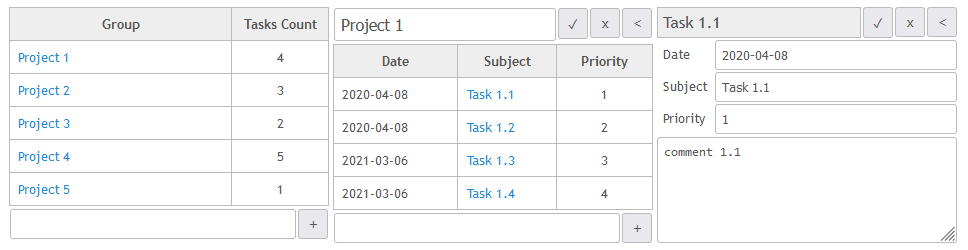

# sdm_demo_todolist_sqlite3_golang
Quick Demo of how to use [SQL DAL Maker](https://github.com/panedrone/sqldalmaker) + Go: Gorm and direct "database/sql".

Both parts are sharing the same Vue.js front-end and the same SQLite3 database.




dto.xml
```xml
<dto-classes>
    
    <dto-class name="gorm-Group" ref="groups"/>
    
    <dto-class name="GroupLi" ref="get_all_groups.sql">
        <header>// Group list item</header>
        <field type="int64${json}" column="g_id"/>
        <field type="string${json}" column="g_name"/>
        <field type="int64${json}" column="g_tasks_count"/>
    </dto-class>
    
    <dto-class name="gorm-Task" ref="tasks"/>
    
    <dto-class name="gorm-TaskLi" ref="tasks">
        <header>// Task list item (no g_id, no t_comments)</header>
        <field column="g_id" type="-"/>
        <field column="t_comments" type="-"/>
    </dto-class>
    
</dto-classes>
```
GroupsDao.xml
```xml
<dao-class>
    <crud dto="gorm-Group" table="groups"/>
    <query-dto-list method="GetAllGroups" dto="GroupLi"/>
</dao-class>
```
TasksDao.xml
```xml
<dao-class>
    <crud dto="gorm-Task" table="tasks"/>
</dao-class>
```
Generated code in action:
```go
package router

import (
	"github.com/gin-gonic/gin"
	"gorm.io/gorm"
	"net/http"
	"sdm_demo_todolist/gorm/dbal"
	"sdm_demo_todolist/gorm/models"
)

func GroupCreate(ctx *gin.Context) {
	var inGr groupCreateUpdate
	err := ctx.ShouldBindJSON(&inGr)
	if err != nil {
		abortWithBadRequest(ctx, err.Error())
		return
	}
	gr := models.Group{}
	gr.GName = inGr.GName
	err = dbal.NewGroupsDao().CreateGroup(ctx, &gr)
	if err != nil {
		abortWith500(ctx, err.Error())
		return
	}
	ctx.Status(http.StatusCreated)
}

func GroupsReadAll(ctx *gin.Context) {
	groups, err := dbal.NewGroupsDao().GetAllGroups(ctx)
	if err != nil {
		abortWith500(ctx, err.Error())
		return
	}
	respondWithJSON(ctx, http.StatusOK, groups)
}

func GroupUpdate(ctx *gin.Context) {
	var uri groupUri
	if err := ctx.ShouldBindUri(&uri); err != nil {
		abortWithBadUri(ctx, err)
		return
	}
	var inGroup groupCreateUpdate
	err := ctx.ShouldBindJSON(&inGroup)
	if err != nil {
		abortWithBadRequest(ctx, err.Error())
		return
	}
	dao := dbal.NewGroupsDao()
	gr, err := dao.ReadGroup(ctx, uri.GId)
	if err != nil {
		abortWith500(ctx, err.Error())
		return
	}
	gr.GName = inGroup.GName
	_, err = dao.UpdateGroup(ctx, gr)
	if err != nil {
		abortWith500(ctx, err.Error())
		return
	}
}

func GroupDelete(ctx *gin.Context) {
	var uri groupUri
	if err := ctx.ShouldBindUri(&uri); err != nil {
		abortWithBadUri(ctx, err)
		return
	}
	gr := &models.Group{
		GId: uri.GId,
	}
	_, err := dbal.NewGroupsDao().DeleteGroup(ctx, gr)
	if err != nil {
		abortWith500(ctx, err.Error())
	}
	ctx.Status(http.StatusNoContent)
}

func GroupRead(ctx *gin.Context) {
	var uri groupUri
	if err := ctx.ShouldBindUri(&uri); err != nil {
		abortWithBadUri(ctx, err)
		return
	}
	group, err := dbal.NewGroupsDao().ReadGroup(ctx, uri.GId)
	if err == gorm.ErrRecordNotFound {
		abortWithNotFound(ctx, err.Error())
	} else if err != nil {
		abortWith500(ctx, err.Error())
	} else {
		respondWithJSON(ctx, http.StatusOK, group)
	}
}
```